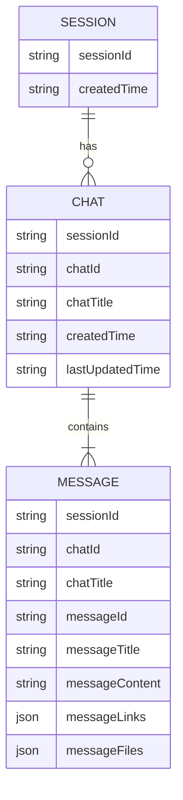

# bkms2-term-project

### Database Design

```mermaid
erDiagram
    SESSION ||--o{ CHAT : has
    SESSION {
        string sessionId
        string createdTime
    }
    CHAT ||--|{ MESSAGE : contains
    CHAT {
        string sessionId
        string chatId
        string chatTitle
        string createdTime
        string lastUpdatedTime
    }
    MESSAGE {
        string sessionId
        string chatId
        string chatTitle
        string messageId
        string messageTitle
        string messageContent
        json messageLinks
        json messageFiles
    }
```
